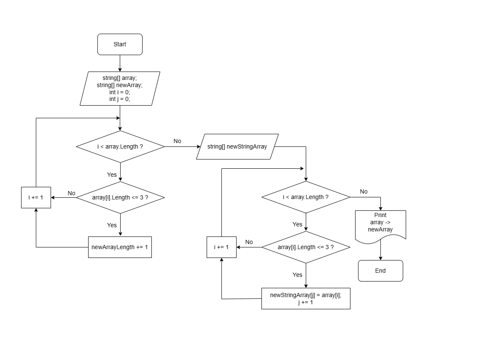

# Итоговая проверочная работа.

***Задача:*** Написать программу, которая из имеющегося массива строк формирует массив из строк, длина которых меньше либо равна 3 символам. Первоначальный массив можно ввести с клавиатуры либо задать на старте выполнения алгоритма. При решении не рекомендуется пользоваться коллекциями, лучше обойтись исключительно массивами.

**Примеры:**

["hello","2","world",":-)"] -> ["2",":-)"]

["1234","1567","-2","computer science"] -> ["2"]

["Russia","Denmark","Kazan"] -> []

## Алгоритм решения:
1. Создаем метод для заполнения первоначального массива строк с клавиатуры.
2. Создаем метод для определения длины нового массива с необходимой длиной строк (согласно условиям - либо равна 3 символам).
3. Пишем метод для создания нового массива с уже известной длиной. 
4. Выводим первоначальный и новый массивы на экран.

## Блок-схема алгоритма

